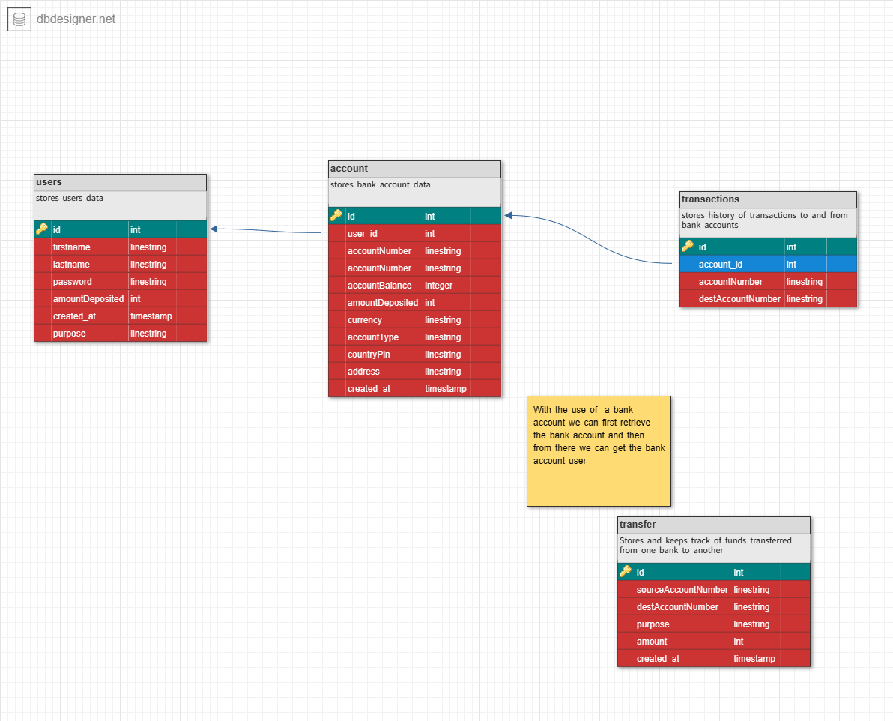

# Lendsqr-Interview
Demo Credit Api using Knex

# Steps
- Clone the project [git clone https://github.com/JosephKithome/Lendsqr-Interview.git]
- Navigate into the projects Root Folder 
- RUN npm install
- For Local Development install XAMPP or any Webserver of your choice
- Create database with name [Lendsqr] OR RUN the following SQL Query

                                                                        CREATE TABLE `users` (
                                                                            `id` int NOT NULL AUTO_INCREMENT,
                                                                            `firstname` linestring NOT NULL,
                                                                            `lastname` linestring NOT NULL,
                                                                            `password` linestring NOT NULL,
                                                                            `amountDeposited` int NOT NULL,
                                                                            `created_at` TIMESTAMP NOT NULL,
                                                                            `purpose` linestring NOT NULL,
                                                                            PRIMARY KEY (`id`)
                                                                        );

                                                                        CREATE TABLE `account` (
                                                                            `id` int NOT NULL AUTO_INCREMENT,
                                                                            `user_id` int NOT NULL,
                                                                            `accountNumber` linestring NOT NULL,
                                                                            `accountNumber` linestring NOT NULL,
                                                                            `accountBalance` INT NOT NULL,
                                                                            `amountDeposited` int NOT NULL,
                                                                            `currency` linestring NOT NULL DEFAULT 'KES',
                                                                            `accountType` linestring NOT NULL DEFAULT 'KES',
                                                                            `countryPin` linestring NOT NULL DEFAULT 'KES',
                                                                            `address` linestring NOT NULL DEFAULT 'KES',
                                                                            `created_at` TIMESTAMP NOT NULL DEFAULT 'KES',
                                                                            PRIMARY KEY (`id`)
                                                                        );

                                                                        CREATE TABLE `transactions` (
                                                                            `id` int NOT NULL AUTO_INCREMENT,
                                                                            `account_id` int NOT NULL AUTO_INCREMENT,
                                                                            `accountNumber` linestring NOT NULL,
                                                                            `destAccountNumber` linestring NOT NULL,
                                                                            PRIMARY KEY (`id`)
                                                                        );

                                                                        CREATE TABLE `transfer` (
                                                                            `id` int NOT NULL AUTO_INCREMENT,
                                                                            `sourceAccountNumber` linestring NOT NULL,
                                                                            `destAccountNumber` linestring NOT NULL,
                                                                            `purpose` linestring NOT NULL,
                                                                            `amount` int NOT NULL,
                                                                            `created_at` TIMESTAMP NOT NULL,
                                                                            PRIMARY KEY (`id`)
                                                                        );

                                                                        ALTER TABLE `account` ADD CONSTRAINT `account_fk0` FOREIGN KEY (`user_id`) REFERENCES `users`(`id`);

                                                                        ALTER TABLE `transactions` ADD CONSTRAINT `transactions_fk0` FOREIGN KEY (`account_id`) REFERENCES `account`(`id`);

- Navigate to .env file and update the connection details to match your  Xampp details.
- Run the application by typing [node server] COMMAND in your bash or powershell console

